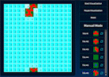

# [wavefunctioncollapse.onrender.com](https://wavefunctioncollapse.onrender.com)

This is a visualizer for the wave function collapse algorithm written in Javascript using React and TailwindCSS and hosted using Render.com. All styling and design is done by me.

# About

Wave function collapse is an algorithm that can create complex organic shapes from simple constraints. There are multiple different implementations that you can use for wave function collapse. For this visualizer, it uses a simple 3-by-3 tile system where the edges of tiles are checked against each other and only matching edges can connect. This simplifies a lot of the logic and allows for easy implementation of rotating tiles.

The core of the algorithm involves 3 steps:

1. Randomly choose a tile with the lowest entropy. (entropy is the measure of how many possible options a given grid position can be based on the state of the grid)
2. Collapse that chosen tile. (collapse means to randomly select one of the remaining options and rotations that are still in the set)
3. recursively update the neighbors and determine which options are left after this new collapse. (This happens recursively, i.e. if one tile has to update its options, then we need to check the neighbors of that tile as well.)

There are more complicated ways of handling the algorithm that allows for even more organic shapes. One such possible way is by having the program read an input image and determine which tiles can go next to which other ones based solely on that input image. You can also use different tile shapes or even use this [algorithm in 3d](https://www.uproomgames.com/dev-log/wave-function-collapse).

[If you are interested in learning more, here is a really well written write up](https://robertheaton.com/2018/12/17/wavefunction-collapse-algorithm/)

# How to Use

To use the website, first you must make a set of tiles. You can make any design you want within the 3-by-3 tile editor, but just remember that only matching edges will join together. Next, scroll down to the visualizer at the bottom of the page. You can either let the algorithm play out by clicking on the `start visualization` button, or you can manually place tiles using the toolbar on the right of the visualizer grid. The beaty of the wave function collapse algorithm is that you can hand craft some parts of the grid and then let the algorithm fill in the missing bits to give a more organic varied look.
